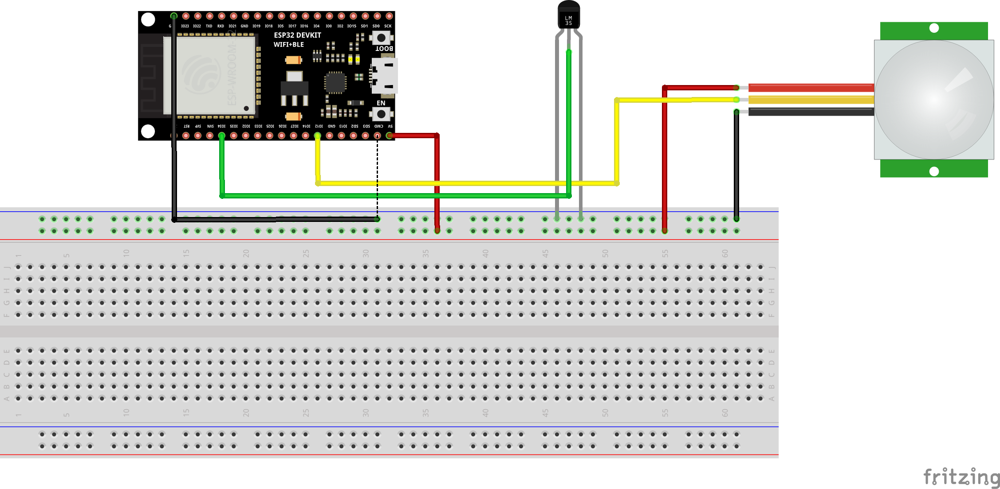

# Telegram-IoT-Alert

This system integrates motion detection and temperature monitoring to demonstrate practical IoT communication.

---

## Abstract

This project presents the design and implementation of an ESP32-based IoT alert system capable of sending real-time notifications through Telegram.
By integrating a PIR motion sensor and a temperature sensor, the system enables monitoring and instant alerts, making it suitable for security and environmental monitering applications.

---
## System Overview

The ESP32 connects to a Wi-Fi network and continuously monitors sensor inputs.  
Upon detecting motion or reading temperature data, the microcontroller communicates with the Telegram Bot API via HTTP requests to deliver alerts to the user.

---

## Hardware Components

- ESP32  
- PIR Motion Sensor  
- Temperature Sensor (LM35)  
- Breadboard  
- Jumper Wires  

---

## Software Tools and Technologies

- Arduino IDE  
- ESP32 Board Support Package  
- Telegram Bot API  
- Wi-Fi Communication  
- HTTP Protocol  

---

## Methodology

1. Establish Wi-Fi connectivity using ESP32  
2. Initialize and read sensor data  
3. Process sensor conditions  
4. Generate alert messages  
5. Transmit alerts via Telegram Bot API  

---

## Circuit Diagram

